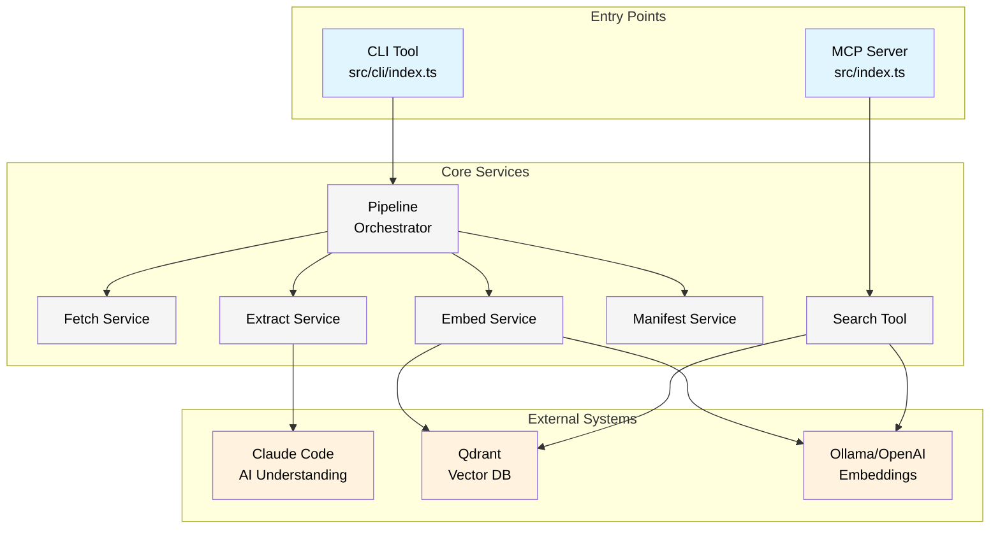

# Architecture

This project implements a documentation intelligence system with two distinct entry points sharing the same core services.

## System Overview



## Architectural Decisions

### 1. Dual Entry Points

The same codebase serves two different use cases:

- **MCP Server**: Exposes a `search_claude_code_docs` tool that Claude can use during conversations
- **CLI**: Direct control over the ingestion pipeline for maintenance and debugging

Both entry points use the same services, ensuring consistency.

### 2. Service Layer Architecture

Each service has a single responsibility:

```typescript
// Example: ManifestService tracks ingestion state
const manifest = new ManifestService(url);  // Extracts domain from URL
manifest.updateExtracted(url, {
  model: 'claude-sonnet-4-5-20250929',
  jsonPath: 'path/to/output.json'
});
```

Services don't know about their consumers (MCP or CLI), making them reusable and testable.

### 3. Provider Abstraction

The system is provider-agnostic through utilities and service interfaces:

```typescript
// Embedding generation uses provider abstraction (utils/embeddings.ts)
import { generateEmbedding } from '../utils/embeddings.js';

// EmbedService uses the abstraction
const embedding = await generateEmbedding(doc.content, provider);
// Provider can be 'ollama' or 'openai'
```

This pattern provides flexibility while maintaining a consistent interface.

## Data Flow

### Ingestion Path (CLI → Storage)

```
URL → Fetch (cache HTML) → Extract (Claude reads) → Embed → Qdrant
         ↓                      ↓                      ↓
     .data/cache/          .data/structured/      Vector DB
```

### Query Path (MCP → Results)

```
User Query → MCP Server → Search Tool → Embeddings → Qdrant → Results
```

## Key Patterns

### 1. Two-Tier Manifest System

The project uses a sophisticated two-tier manifest system for tracking ingestion state:

- **Master Manifest** (`.data/manifest.json`) - Tracks all documentation sources
- **Domain Manifests** (`.data/{domain}/manifest.json`) - Track individual URLs per domain

See [Manifest System Documentation](./manifest-system.md) for complete details on:
- Status lifecycle (fetched → extracted → embedded)
- TTL-based freshness tracking (7-day default)
- Auto-registration of new sources
- How commands use manifests

### 2. Multi-Domain Support

The manifest system naturally supports multiple documentation sources:

```
.data/
├── manifest.json              # Master manifest (all sources)
├── docs.claude.com/
│   ├── manifest.json         # Domain manifest
│   ├── cache/                # HTML cache
│   └── structured/           # Extracted JSON
└── docs.anthropic.com/
    ├── manifest.json
    ├── cache/
    └── structured/
```

Each domain is automatically discovered via `ManifestService.getAllDomains()`.

### 3. Pipeline Stages

Each stage can run independently or as part of the full pipeline (see [CLI Guide](./how-to-use-the-cli.md) for detailed commands).

## Command Architecture

The CLI uses two patterns based on complexity:

### Simple Commands (Functions)
For straightforward pipeline proxies with minimal logic:
- `fetch`, `extract`, `embed`, `ingest`
- `status`, `list`

### Complex Commands (Classes)
For commands with significant business logic (>20 lines):
- `SeedCommand` - Bootstrap with core/all pages
- `SyncCommand` - Update stale documentation
- `SearchCommand` - Query vector database
- `SourcesCommand` - Manage documentation sources

This separation keeps simple things simple while allowing complex commands to scale.

## Services Overview

### Core Services

**ManifestService** (`src/services/manifest-service.ts`)
- Manages domain-level manifest files
- Tracks URL ingestion status and metadata
- Auto-registers domains in master manifest

**MasterManifestService** (`src/services/master-manifest-service.ts`)
- Global registry of all documentation sources
- Tracks source types and sync times
- Enables multi-source discovery

**Pipeline** (`src/cli/pipeline/index.ts`)
- Orchestrates fetch → extract → embed stages
- Handles resume-on-failure logic
- Manages content change detection

### Supporting Services

**FetchService** - HTML caching with content hashing
**ExtractService** - Claude-powered content extraction
**EmbedService** - Vector embedding generation and storage
**PipelineLoggingService** - Structured logging for debugging

## Extension Points

The architecture makes these extensions trivial:

1. **New Documentation Sources**: Add URLs to config or ingest any URL directly
2. **New Embedding Providers**: Implement provider interface in `utils/embeddings.ts`
3. **New Storage Backends**: Replace Qdrant client
4. **New Extraction Models**: Change model parameter

The key insight: **Claude's understanding makes traditional parsing obsolete**. The architecture embraces this by making Claude the central intelligence, not just another component. See [Pipeline Stages](./pipeline.md#the-key-insight) for why this matters.

## Related Documentation

- [Pipeline Stages](./pipeline.md) - How the ingestion pipeline works and the philosophy behind it
- [Manifest System](./manifest-system.md) - Two-tier manifest architecture for state tracking
- [CLI Guide](./how-to-use-the-cli.md) - Command reference and usage
