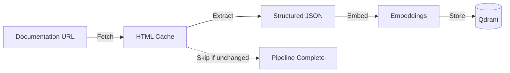

# Pipeline

The ingestion pipeline transforms documentation URLs into searchable knowledge through distinct stages.

## Pipeline Overview



## Stage Details

### 1. Fetch Stage

**Purpose**: Download and cache HTML, detect changes

```bash
npm run cli:fetch https://docs.claude.com/overview
```

**What it does:**

- Downloads HTML content
- Strips scripts and styles for cleaner extraction
- Compares with previous version (content hash)
- **Skips entire pipeline if unchanged** (smart optimization)

**Output:**

```
.data/docs.claude.com/cache/
└── overview.html  # Clean HTML, ready for extraction
```

### 2. Extract Stage

**Purpose**: Claude reads and understands the documentation

```bash
npm run cli:extract https://docs.claude.com/overview
# Or with specific model
npm run cli -- extract https://docs.claude.com/overview --model claude-opus
```

**How It Works:**

The extract stage uses a Python subprocess (`tools/extract.py`) that:
1. Reads the cached HTML from `.data/{domain}/cache/`
2. Loads a specialized prompt for documentation extraction
3. Calls Claude CLI with the HTML content and prompt
4. Returns structured JSON output

```python
# Simplified conceptual flow (actual implementation in tools/extract.py)
html_content = read_file(".data/docs.claude.com/cache/overview.html")
prompt = read_file("src/prompts/claude-docs.prompt.md")

# Claude analyzes the documentation
response = claude_cli.complete(
    prompt=prompt,
    content=html_content,
    model="claude-sonnet-4-5-20250929"
)
```

**Output:**

```json
{
  "title": "Claude Code Overview",
  "sections": [
    {
      "heading": "Installation",
      "content": "Natural language description...",
      "codeExamples": [...],
      "keyInsights": [
        "Hook configuration affects all operations",
        "MCP servers run as separate processes"
      ]
    }
  ]
}
```

**Why Claude, not JSDOM?**

- Understands context: "this refers to the previous example"
- Extracts relationships: "hooks interact with agents"
- Identifies importance: "this warning is critical"
- Preserves nuance: "usually means X but can mean Y"

### 3. Embed Stage

**Purpose**: Convert to searchable vectors

```bash
npm run cli:embed https://docs.claude.com/overview
# Or with specific provider
npm run cli -- embed https://docs.claude.com/overview --provider openai
```

**Processing:**

The embed stage uses the `EmbedService` to:
1. Load the extracted JSON from `.data/{domain}/structured/`
2. Generate embeddings for each section
3. Store vectors and metadata in Qdrant

```typescript
// Simplified conceptual flow (actual implementation in src/services/embed-service.ts)
const extractedData = loadJSON(".data/docs.claude.com/structured/overview.json");
const embedService = new EmbedService(qdrantClient, provider);

// Process each section into searchable vectors
const result = await embedService.embed(extractedData, provider);
// Result contains: documentsProcessed, embeddingsGenerated, stats
```

**Smart Chunking:**

- Respects semantic boundaries (sections, not arbitrary splits)
- Preserves code example associations
- Maintains heading hierarchies

## Pipeline Commands

### Full Pipeline

```bash
# Everything in one go
npm run cli:ingest https://docs.claude.com/overview

# With options (note: use cli -- for passing arguments)
npm run cli -- ingest https://docs.claude.com/overview \
  --model claude-opus \
  --provider openai \
  --force  # Skip cache check
```

### Individual Stages

```bash
# Debug extraction issues with minimal prompt
npm run cli -- extract https://docs.claude.com/overview --dev

# Re-embed with different provider
npm run cli -- embed https://docs.claude.com/overview --provider openai

# Check status of a URL
npm run cli:status https://docs.claude.com/overview
```

### Batch Operations

```bash
# Bootstrap core documentation
npm run seed

# Update stale documentation (older than 7 days)
npm run sync

# Preview what would be updated
npm run sync --check
```

## Manifest Tracking

Every pipeline run updates the manifest:

```json
{
  "https://docs.claude.com/overview": {
    "status": "embedded",
    "lastFetchedAt": "2025-10-01T10:00:00Z",
    "lastExtractedAt": "2025-10-01T10:01:00Z",
    "lastEmbeddedAt": "2025-10-01T10:02:00Z",
    "contentHash": "abc123...",
    "extractionModel": "claude-sonnet",
    "embeddingProvider": "ollama",
    "sectionCount": 8,
    "codeExampleCount": 12
  }
}
```

This enables:

- TTL-based updates (`sync` command)
- Skip unchanged content
- Track which model extracted what
- Debug extraction quality

## Error Handling

The pipeline is resilient:

```typescript
// Batch processing continues despite failures
for (const url of urls) {
  try {
    await pipeline.ingest(url);
  } catch (error) {
    logger.error(`Failed: ${url}`, error);
    // Continue with next URL
  }
}
```

**Recovery strategies:**

- Cached HTML survives extraction failures
- Extracted JSON survives embedding failures
- Partial embeddings are better than none
- Manifest tracks last successful stage

## Implementation Details

### Stage Execution

Each stage is implemented as a function in `src/cli/pipeline/`:
- `fetch.ts` - Downloads and caches HTML
- `extract.ts` - Calls Python subprocess with Claude
- `embed.ts` - Generates vectors and stores in Qdrant

The pipeline orchestrator (`src/cli/pipeline/index.ts`) coordinates these stages and handles:
- Content change detection
- Resume on failure
- Manifest updates
- Progress reporting

### Python Integration

The extract stage uses Python (`tools/extract.py`) for Claude interaction:
- Provides better isolation and error handling
- Uses Claude CLI directly
- Validates JSON output before returning
- Handles retries and timeouts

## The Key Insight

Traditional documentation scrapers:

1. Parse HTML mechanically
2. Extract based on selectors
3. Miss context and relationships
4. Break when structure changes

This pipeline:

1. **Claude reads like a human**
2. Understands context and importance
3. Extracts implicit knowledge
4. Adapts to structure changes

The pipeline stages exist to support this core innovation: **AI understanding over mechanical parsing**.

## Related Documentation

- [Manifest System](./manifest-system.md) - How pipeline stages update manifests
- [Architecture](./architecture.md) - Overall system design
- [CLI Guide](./how-to-use-the-cli.md) - Complete command reference
