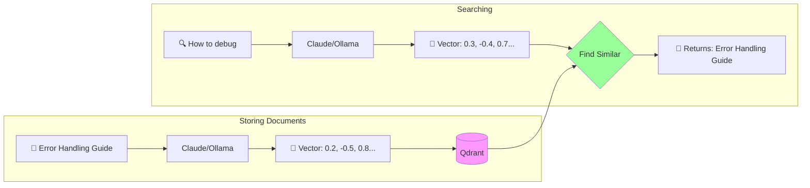

# Qdrant Vector Database

## What is Qdrant?

Qdrant is a vector database - instead of storing rows and columns like traditional databases, it stores high-dimensional vectors (lists of numbers) that represent meaning.

Think of it as "semantic Google" for your data:

- **Traditional DB**: Searches for exact matches
- **Vector DB**: Searches for similar meaning

## Why We Need Vector Search

### The Problem with Keywords

```
Query: "How to fix bugs"
Traditional search: ❌ Misses docs about "error handling", "debugging", "troubleshooting"
Vector search: ✅ Finds all conceptually related content
```

### How It Works



## Our Qdrant Setup

### What We Store

Each document in our collection contains:

- **Vector**: 768-dimensional embedding (from Ollama)
- **Payload**: Metadata including:
  - Title and content
  - Source URL
  - Key concepts
  - Code examples
  - Extraction timestamp

### Collection Structure

```json
{
  "collection": "claude_code_docs_ollama",
  "vectors": {
    "size": 768,
    "distance": "Cosine"
  },
  "points_count": 60-100  // typical range
}
```

## Quick Commands

```bash
# Check if Qdrant is running
curl http://localhost:6333/health

# View collection info
curl http://localhost:6333/collections/claude_code_docs_ollama | jq .

# Count documents
curl http://localhost:6333/collections/claude_code_docs_ollama | jq .result.points_count

# Delete collection (careful!)
curl -X DELETE http://localhost:6333/collections/claude_code_docs_ollama
```

## Understanding Similarity

Qdrant uses **cosine similarity** to find related documents:

- `1.0` = Identical meaning
- `0.7-0.9` = Highly related
- `0.5-0.7` = Somewhat related
- `<0.5` = Different topics

This is why searching for "fix bugs" finds documents about "error handling" - their vectors point in similar directions in 768-dimensional space.

## Next Steps

- **[Setup Guide](./setup.md)** - Install and configure Qdrant
- **[Operations](./operations.md)** - Manage collections and data

## Learn More

- [Qdrant Documentation](https://qdrant.tech/documentation/)
- [What are Vector Databases?](https://qdrant.tech/articles/what-are-vector-embeddings/)
